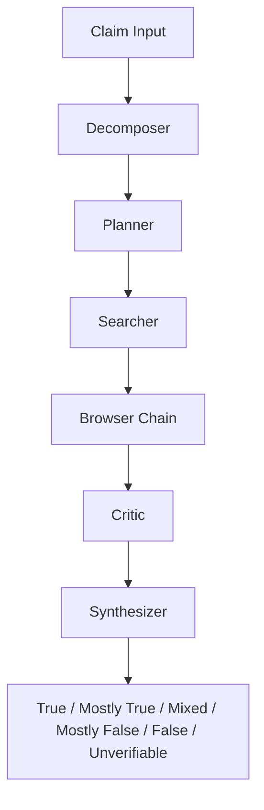

# TrustLens

TrustLens is a cyber-focused investigation platform for forensic file review, deep fact-check research, and AI-assisted analysis. It unifies document/image evidence workflows, source verification pipelines, and desk-specific operations (Legal, Compliance, TruthDesk) with actionable runbooks, file-context chat, and defensible verdict support.

## At a Glance

| Area | Status | Notes |
| --- | --- | --- |
| 🧪 Fact Check Engine | ✅ Live | URL/Image/Document intake with deep research flow |
| 🧰 Forensic Workspace | ✅ Live | Evidence preview, metadata, integrity, forensic controls |
| 🤖 AI Assistant | ✅ Live | GPT-style chat + `From Files` context selection |
| 🌐 Deployment | ✅ Live | Frontend + backend deployed on Vercel |
| 🔐 Security | ⚠️ Configure | Set `GROQ_API_KEY` in backend env vars |

## Visual Flow

```mermaid
flowchart LR
  A[User Intake] --> B[Frontend React/Vite]
  B --> C[FactCheck API Client]
  C --> D[FastAPI + LangGraph]
  D --> E[Search/Browse/Critic/Synthesizer]
  E --> F[Verdict + Sources + Recommendations]
  F --> B
  B --> G[AI Assistant Chat]
  G --> H[/api/factcheck/chat]
```



## Highlights
- Deep fact-check pipeline for URL, image, and document inputs
- Forensic document/media workspace with metadata and risk signals
- GPT-style AI Assistant with `From Files` attachment context
- Cyber runbooks and SOC launch templates for operational use
- Desk-based experience: Legal, Compliance, TruthDesk
- Backend endpoints for investigation and assistant chat workflows

## Tech Stack

### Frontend
- React 18 + TypeScript
- Vite 5
- Tailwind CSS
- shadcn/ui component system
- Lucide React icons
- Recharts (where visualization is used)
- Local state + localStorage workspace stores (`src/utils/inside*Data.ts`)

### Backend
- Python 3.10+
- FastAPI
- LangGraph orchestration for fact-check research flow
- Requests-based web retrieval and source processing
- Optional Groq chat-completions integration for assistant responses

### App Runtime
- Node.js 18+
- npm
- Optional Tauri desktop wrapper (`src-tauri`)

## Architecture

### Core Frontend Modules
- `InsideDashboard.tsx` - desk command center and runbooks
- `InsideDocuments.tsx` - document/image registry and forensic flows
- `InsideFactCheck.tsx` - deep research intake + result workflow
- `InsideChat.tsx` - GPT-style assistant with file attachment context
- `InsideInfantry.tsx` - operational remediation lane
- `InsideRebuild.tsx` - tab orchestration and desk-mode shell

### Core Backend Modules
- `backend/factcheck_graph/app.py`
  - `/api/factcheck/run` for LangGraph deep research
  - `/api/factcheck/chat` for assistant Q&A (Groq-enabled fallback pattern)

### Fact-Check Graph Flow
- Decomposer
- Planner
- Searcher
- Browser chain
- Critic
- Synthesizer

## Repository Structure

```text
TRUST-LENS-main/
  backend/
    factcheck_graph/
      app.py
      requirements.txt
  src/
    components/
      InsideDashboard.tsx
      InsideDocuments.tsx
      InsideFactCheck.tsx
      InsideChat.tsx
      InsideInfantry.tsx
      InsideRebuild.tsx
    utils/
      factcheckGraphApi.ts
      assistantApi.ts
      insideData.ts
      insideDocumentsData.ts
      insideFactCheckData.ts
      insideChatData.ts
      insideProfileData.ts
  package.json
  README.md
```

## Screenshots
### Dashboard


### Documents


### Fact Check


### AI Assistant


### Infantry


## Setup

## Prerequisites
- Node.js 18+
- npm
- Python 3.10+

## Install dependencies
From repository root:

```bash
npm install
```

Backend dependencies:

```bash
pip install -r backend/factcheck_graph/requirements.txt
```

## Environment Variables

### Backend (for Groq assistant responses)
Set in the same terminal where backend runs:

```powershell
$env:GROQ_API_KEY="your_groq_api_key"
$env:GROQ_MODEL="llama-3.1-8b-instant"
```

If unset, assistant still returns fallback responses using provided file context.

### Frontend (optional)
- `VITE_FACTCHECK_GRAPH_API` (default: `http://127.0.0.1:8787`)
- `VITE_FACTCHECK_ALLOW_BROWSER_FALLBACK` (`1` to enable fallback paths)

## Run

### 1) Start backend
From repo root:

```bash
npm run factcheck:api
```

or from `backend/`:

```bash
python -m uvicorn factcheck_graph.app:app --host 127.0.0.1 --port 8787
```

### 2) Start frontend
From repo root, new terminal:

```bash
npm run dev
```

### 3) Open app
Use the local URL printed by Vite (commonly `http://localhost:8080` in this project setup).

## Feature Walkthrough

### 1) Documents
- Upload documents/images
- Inspect trust/risk metadata
- Use outputs as context for assistant and fact-check workflows

| Documents Capability | What It Helps With |
| --- | --- |
| 📄 PDF/Image preview | Quick evidence triage and readability |
| 🧬 Metadata fingerprint | Identify producer/editor anomalies |
| 🔎 IOC/PII extraction | Spot risky indicators early |
| 🧾 Integrity hashes | Preserve traceable verification record |

### 2) Fact Check
- Choose URL/image/document intake
- Run deep investigation
- Review coverage, analysis, and recommendations

| Fact Check Output | Description |
| --- | --- |
| 📰 Output 1 | News + source coverage with gathered links |
| ❓ Output 2 | Q&A on gathered sources (true/false/explain) |
| 🔁 Output 3 | Related incident recommendations |
| 🧵 Timeline | Research steps and pipeline progress events |

### 3) AI Assistant (`From Files` flow)
- Open AI Assistant
- Click `From Files`
- Select uploaded file
- Ask context-specific questions
- Assistant sends selected file context to backend `/api/factcheck/chat`

## API Endpoints

### `GET /health`
Backend health status.

### `POST /api/factcheck/run`
Runs deep fact-check LangGraph workflow.

Example:

```json
{
  "claim": "...",
  "source_url": "https://...",
  "context": "...",
  "input_type": "url",
  "file_name": "optional"
}
```

### `POST /api/factcheck/chat`
Assistant chat with optional selected file context.

Example:

```json
{
  "mode": "truthdesk",
  "question": "What does this file indicate?",
  "selected_asset": {
    "id": "doc-1",
    "name": "report.pdf",
    "type": "application/pdf",
    "summary": "reviewing | trust 72 | risks 2",
    "extracted_text": "..."
  },
  "history": [
    {"role": "user", "content": "..."},
    {"role": "assistant", "content": "..."}
  ]
}
```

## Authentication and Identity
- Login/signup flows are part of the workspace lifecycle
- Profile state is mirrored to `userProfile`
- Face capture/verification utilities are integrated via:
  - `src/components/FaceCapture.tsx`
  - `src/utils/faceApi.ts`
  - `src/utils/faceUtils.ts`
  - `src/utils/insideProfileData.ts`

## Data Persistence
Client-side stores are persisted via localStorage:
- dashboard store
- documents store
- fact-check store
- chat store
- profile/settings stores

## Troubleshooting
- Assistant returns fallback: verify backend is running with `GROQ_API_KEY`
- From Files empty: ensure files exist in Documents and refresh tab
- CORS errors: confirm frontend points to active backend URL
- Sparse fact-check results: provide stronger claim/context and source URL

## Security Notes
- Never commit API keys
- Use environment variables for secrets
- Treat uploaded evidence as sensitive data

## Roadmap
- Multi-file attach in assistant
- Rich citation rendering in assistant replies
- Stronger server-side persistence options
- Role-based access controls

## Contributing

1. Fork the repository.
2. Create a feature branch:
   ```bash
   git checkout -b feat/your-feature-name
   ```
3. Make changes with clear commit messages.
4. Run local checks (frontend + backend run).
5. Open a pull request with:
   - what changed,
   - why it changed,
   - screenshots for UI updates,
   - testing notes.

## New Developer Setup

Run these from project root:

```bash
npm install
pip install -r backend/factcheck_graph/requirements.txt
```

Start backend:

```powershell
$env:GROQ_API_KEY="your_key"
$env:GROQ_MODEL="llama-3.1-8b-instant"
npm run factcheck:api
```

Start frontend in another terminal:

```bash
npm run dev
```
